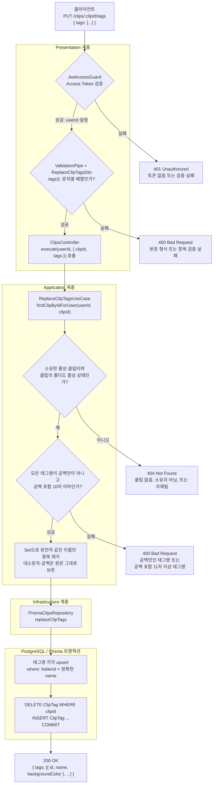

# 클립 태그 전체 교체 API 흐름

`PUT /clips/:clipId/tags`는 클립에 연결된 태그를 이름 목록으로 전체 교체합니다. 클라이언트는 태그 ID를 보낼 필요가 없습니다.

- `tags`: 클립에 연결할 태그 이름 전체 목록입니다.
- 서버는 클립의 현재 폴더에서 정확히 같은 이름의 태그를 재사용하고, 없으면 새 태그 옵션을 생성합니다.
- `tags: []`이면 해당 클립의 모든 태그 연결이 해제됩니다.
- 새로 생성된 태그의 배경색은 `GRAY`이며, 기존 태그는 저장된 배경색을 그대로 반환합니다.

## 요청과 응답

```http
PUT /clips/{clipId}/tags
Content-Type: application/json
```

```json
{
  "tags": ["backend", "New tag", "New tag "]
}
```

```json
{
  "tags": [
    { "id": "tag-backend", "name": "backend", "backgroundColor": "BLUE" },
    { "id": "tag-new", "name": "New tag", "backgroundColor": "GRAY" },
    { "id": "tag-new-trailing-space", "name": "New tag ", "backgroundColor": "GRAY" }
  ]
}
```

## 처리 흐름



## 태그 이름 규칙

| 규칙                      | 예시                                               |
| ------------------------- | -------------------------------------------------- |
| 대소문자를 구분           | `Backend`와 `backend`는 다른 태그                  |
| 공백을 원문 그대로 구분   | `dev ops`, `dev  ops`, ` dev ops`는 모두 다른 태그 |
| 공백을 포함해 최대 10자   | `a b c d e`는 9자, 11자 이상은 거부                |
| 공백만으로 된 이름은 거부 | `"   "`은 유효하지 않음                            |

이름을 trim·소문자화·공백 축약하지 않습니다. 폴더별 `Tag(folderId, name)` 고유 제약을 그대로 사용하므로, 완전히 같은 이름만 기존 태그로 재사용합니다.

## 핵심 규칙

- **노션식 태그 옵션 모델**: `Tag`는 폴더에 속한 재사용 가능한 태그 옵션이고, `ClipTag`는 클립이 선택한 옵션 연결입니다.
- **전체 교체**: 기존 `ClipTag` 연결을 모두 삭제한 뒤, 요청된 태그만 새로 연결합니다.
- **기존 태그 재사용·새 태그 자동 생성**: 각 이름을 현재 폴더 기준으로 upsert하므로, 클라이언트는 ID를 알 필요가 없습니다.
- **원자성**: 태그 옵션 생성 또는 재사용과 `ClipTag` 교체가 하나의 Prisma 트랜잭션에서 실행됩니다.
- **응답 순서**: 중복 제거된 요청 이름 순서대로 반환합니다.

## 오류 응답 요약

| 상태               | 발생 조건                                                          |
| ------------------ | ------------------------------------------------------------------ |
| `401 Unauthorized` | Access Token이 없거나 유효하지 않음                                |
| `400 Bad Request`  | 요청 형식 오류, 공백만인 태그명, 또는 공백 포함 11자 이상인 태그명 |
| `404 Not Found`    | 클립이 없거나 요청 사용자가 소유하지 않음, 클립 또는 폴더가 삭제됨 |

## 구현 기준 파일

- [컨트롤러](../src/clips/presentation/clips.controller.ts)
- [요청 DTO](../src/clips/presentation/dtos/replace-clip-tags.dto.ts)
- [유스케이스](../src/clips/application/usecases/replace-clip-tags.usecase.ts)
- [Repository 계약](../src/clips/domain/clips.repository.ts)
- [Prisma 구현](../src/clips/infrastructure/prisma-clips.repository.ts)
