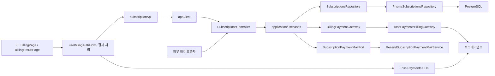
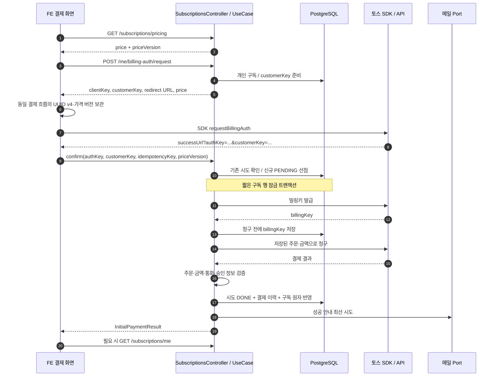
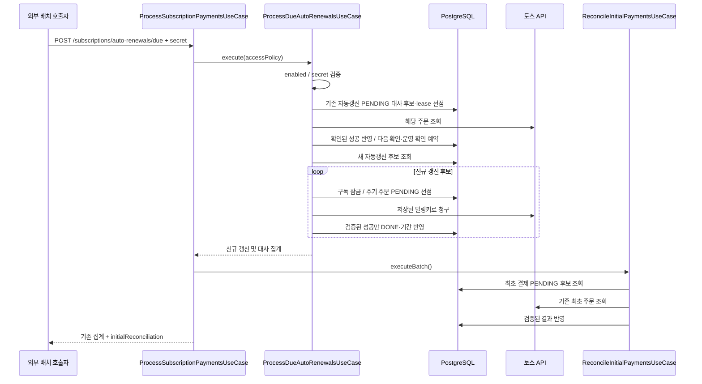
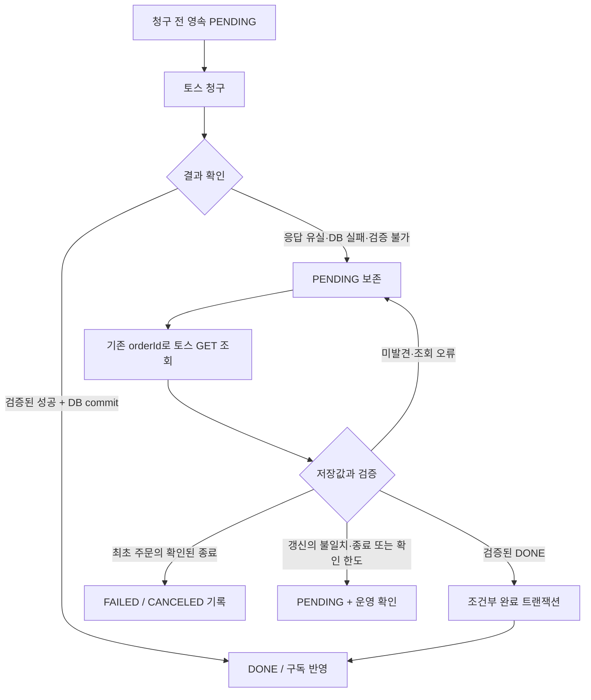
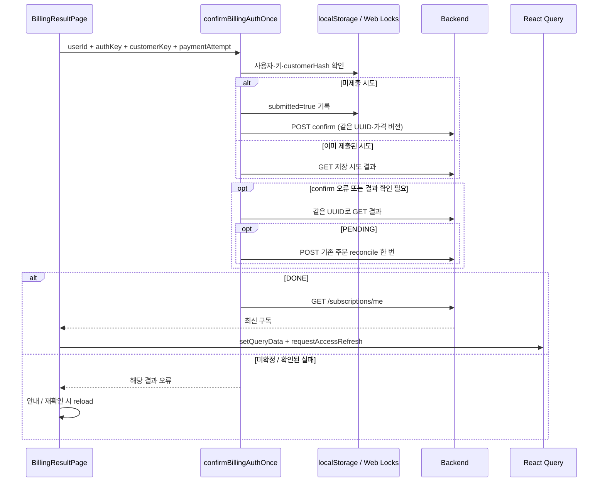
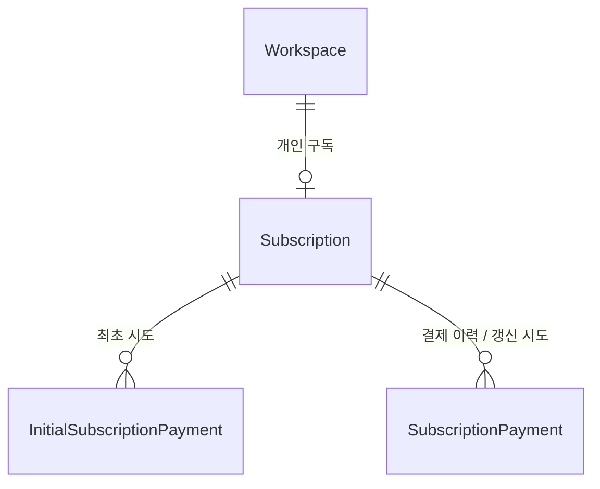

# 결제 아키텍처

> 기준일: 2026-09-13
> 조사 범위: easy-clip-be `feat/161` 작업 트리의 subscriptions 구현과 인접 저장소 easy-clip-fe의 실제 결제·구독 import 및 호출 관계
> 참고 양식: easy-clip-fe의 `docs/auth-architecture.md` 인증 아키텍처. 개요, 책임 표, 실제 흐름, 상태 모델, 폴더 구조, 설계 선택 순서를 따른다.
> **확인 필요:** P1 작업 트리의 구현을 설명하며 운영 배포 완료를 뜻하지 않는다. 실제 판매 가격·환불·가격 변경 고지 정책과 런타임 시크릿·배치 호출 일정은 이 문서에서 확정하지 않는다.

## 1. 결제 아키텍처 개요

현재 결제는 **토스 빌링 인증 + 서버 최초 청구 + 영속 결제 시도 + 자동갱신 배치 + 주문 조회 대사** 구조다. 대사는 결제사에 남은 주문 결과와 내부 DB를 비교해 확인된 결과를 반영하는 처리다.

- FE는 서버의 공개 가격을 표시하고 토스 SDK로 결제수단 인증을 시작한다.
- 토스 인증 성공 redirect는 `authKey`와 `customerKey`를 FE에 전달한다. 이 redirect 자체는 청구 성공이 아니다.
- BE는 최초 결제 시도와 가격을 DB에 먼저 저장하고 빌링키 발급·청구를 수행한다.
- 검증된 청구 성공은 결제 기록과 개인 워크스페이스 구독에 같은 트랜잭션으로 반영한다.
- 응답 유실·DB 반영 실패는 `PENDING`으로 보존한다. 같은 주문의 결과를 조회하며 다시 청구하지 않는다.
- 다음 달의 신규 청구는 보호된 배치 API가 실행한다. 토스나 FE가 서버 대신 매월 청구를 예약하는 구조는 아니다.
- FE의 구독 표시·캐시는 BE 결과의 투영이며, 최종 권한은 BE가 저장 상태와 유효 기간으로 판정한다.

### 결제 사실·구독 상태·클라이언트 상태

| 구분                         | 단일 원천                        | 현재 책임                                                                 |
| ---------------------------- | -------------------------------- | ------------------------------------------------------------------------- |
| 실제 외부 청구 결과          | 토스 주문 조회 결과              | 해당 주문의 승인·취소 등 외부 결제 사실 확인                              |
| 현재 이용권과 다음 청구      | `Subscription`                   | plan, status, autoRenew, 이용 기간, 다음 청구 시각, 빌링키 보관           |
| 최초 결제 처리 상태          | `InitialSubscriptionPayment`     | 사용자 결제 시도, 저장된 가격, 주문, 멱등키, 복구 일정, 진행 중 해지 의사 |
| 결제 이력·자동갱신 처리 상태 | `SubscriptionPayment`            | 확정 결제 이력 및 자동갱신 PENDING 주문·대사 정보                         |
| FE 서버 상태                 | 구독/공개 가격 React Query       | BE 응답과 조회 상태 보관, 결제·해지·재개 이후 화면 동기화                 |
| FE 진행 상태                 | 결제 hook과 브라우저 시도 저장소 | SDK 호출, redirect 복귀, 동일 결제 키 유지, 처리 중/완료 화면             |

`PENDING`은 결제 실패가 아니라 **결과를 아직 확정하지 못한 상태**다. 반대로 토스가 승인했더라도 내부 반영이 끝나기 전에는 구독이 아직 FREE일 수 있다.

### 실제 import·호출 관계



`SubscriptionsModule`은 repository·gateway·mail port의 구현체를 연결한다. HTTP 입력은 presentation, 흐름과 검증은 application, 영속화와 외부 통신은 infrastructure가 담당한다.

## 2. 주요 구성 요소

| 구성 요소                                                  | 실제 역할과 책임                                                                                            |
| ---------------------------------------------------------- | ----------------------------------------------------------------------------------------------------------- |
| `useBillingAuthFlow` / `BillingResultPage`                 | 기존 시도·구독 확인, SDK 시작, redirect 복귀, 결과 확인과 화면 이동을 조합한다.                             |
| `billingAttempt` / `confirmBillingAuthOnce`                | 브라우저 시도와 동일 키의 확인·복구를 관리한다. 서버 과금 여부를 독자적으로 확정하지 않는다.                |
| `SubscriptionsController`                                  | 가격·내 구독·인증 요청·최초 청구·조회/대사·배치 HTTP 경로를 use case에 연결한다.                            |
| `GetSubscriptionPriceUseCase` / `resolveProMonthlyPrice`   | 명시된 가격 설정을 검증하고 금액·통화·월간 주기·불투명 priceVersion을 반환한다.                             |
| `CreateBillingAuthRequestUseCase`                          | 개인 구독의 customerKey를 준비하고 FE SDK에 필요한 clientKey·redirect URL·가격을 제공한다. 과금하지 않는다. |
| `ConfirmBillingAuthUseCase`                                | 기존 시도 재조회, 유효한 취소 구독의 무과금 재개, 신규 시도 선점·빌링키 발급·청구를 조합한다.               |
| `GetInitialPaymentUseCase`                                 | 로그인 사용자의 저장된 시도 결과를 조회한다. 결제사를 호출하지 않는다.                                      |
| `ReconcileInitialPaymentsUseCase`                          | 최초 청구 응답 검증·반영, 소유자 요청 및 배치의 주문 조회 복구를 공통 처리한다.                             |
| `ProcessSubscriptionPaymentsUseCase`                       | 보호된 자동갱신 실행을 먼저 완료하고 최초 결제 대사 배치를 이어 실행한다.                                   |
| `ProcessDueAutoRenewalsUseCase`                            | 배치 허용 여부·시크릿을 검사하고 기존 자동갱신 대사, 새 갱신 선점·청구, 결과 집계를 수행한다.               |
| `GetMySubscriptionUseCase` / `UpdateMySubscriptionUseCase` | 구독 조회·만료 정규화와 CANCEL/RESUME 명령을 처리한다.                                                      |
| `PrismaSubscriptionsRepository`                            | 구독 행 잠금, 시도 유일성, 조건부 결제 완료, 이력·구독의 원자적 반영을 보장한다.                            |
| `TossPaymentsBillingGateway`                               | 토스 HTTP 인증, 발급·청구·조회, 응답 변환, 제한 시간과 선택적 멱등 헤더를 담당한다.                         |
| `ResendSubscriptionPaymentMailService`                     | 성공 결제·구독 재개 안내 메일을 보낸다. 메일 성공 여부가 결제 상태를 결정하지 않는다.                       |

## 3. 구독 조회와 공개 가격 흐름

### 내 구독 조회

`GET /subscriptions/me`는 access 인증 뒤 개인 워크스페이스의 구독을 가져온다. 구독이 없으면 FREE 구독을 생성하므로, 최초 조회가 단순 SELECT만 수행하는 것은 아니다.

1. `getOrCreatePersonalSubscription(userId)`가 개인 워크스페이스와 구독을 확보한다.
2. `normalizeExpiredSubscription()`이 `PRO`, `autoRenew=false`, 종료일 경과 조건을 확인한다.
3. 만료 저장은 읽었던 종료일과 자동갱신 상태가 그대로인 경우에만 수행한다. 뒤늦은 만료 요청이 복구된 유료 기간을 덮어쓰지 않게 한다.
4. FE에 plan·status·autoRenew·currentPeriodEnd·nextBillingAt·provider를 반환한다. 빌링키는 반환하지 않는다.

### 가격의 공통 기준

| 값                       | 공급원·해석                                                                      |
| ------------------------ | -------------------------------------------------------------------------------- |
| amount                   | `PRO_MONTHLY_AMOUNT`. 양의 정수를 명시해야 하며 임의 판매 가격 fallback이 없다.  |
| currency                 | `TOSS_PAYMENTS_CURRENCY`. 현재 구현의 허용 통화는 KRW다.                         |
| interval / intervalCount | MONTH / 1. 기존 월간 구독 구현을 표현한다.                                       |
| priceVersion             | 플랜·금액·통화·주기 조합으로 생성한 해시. FE는 생성 규칙 대신 반환값을 보관한다. |

공개 `GET /subscriptions/pricing`와 인증 요청 응답의 `price`가 같은 helper를 사용한다. 최초 청구·신규 자동갱신도 같은 설정을 읽는다. 신규 최초 결제의 `priceVersion`이 현재 가격과 다르면 외부 호출 전에 409로 거부한다. 이미 저장된 시도는 설정이 바뀌어도 저장된 금액·통화로 복구한다.

이 구조는 **값의 일치**를 제공한다. 기존 고객의 인상 동의, 이전 가격 유지, 인상 시행일 관리까지 구현한 것은 아니다. 설정 변경은 다음 신규 자동갱신 청구에 영향을 주므로 운영 정책 확정과 분리해 다뤄야 한다.

## 4. 최초 결제 흐름

### 빌링 인증과 최초 청구



그림은 신규 성공 경로다. confirm에는 다음 분기가 먼저 존재한다.

- **customerKey 불일치:** 400. 다른 구독의 인증값을 사용할 수 없다.
- **같은 키의 시도가 이미 있음:** 기존 결과를 반환하거나 그 주문을 대사한다. 다시 빌링키를 발급하거나 과금하지 않는다.
- **유효 기간이 남은 PRO/CANCELED와 저장된 빌링키가 있음:** 기존 무과금 재개를 수행한다. 결과는 `attemptId=null`, `status=DONE`이다.
- **신규 시도인데 가격 버전이 다름:** 409. 외부 호출 전 거부한다.
- **유효한 PRO 또는 다른 미확정 최초/갱신 결제가 있음:** 잠금 안에서 선점을 거부한다. 여러 키로 호출해도 별도 청구를 시작하지 않는다.

최초 성공 검증은 주문 ID·금액·통화·비어 있지 않은 결제 키·유효한 승인 시각·저장된 빌링키를 요구한다. 승인 시각은 시도 생성 시각보다 60초 이상 과거이거나 현재보다 60초 이상 미래이면 반영하지 않는다. 네트워크와 DB 오류는 저장된 시도를 `PENDING`으로 남긴다.

## 5. 자동갱신 흐름



현재 실행 순서는 **자동갱신 대사 → 신규 자동갱신 → 최초 결제 대사**다. 앞선 실행이 예외로 끝나면 뒤 단계가 실행되지 않는다. 비활성화나 잘못된 시크릿은 어떤 결제 조회·청구도 시작하기 전에 거부한다.

신규 자동갱신 후보는 PRO/ACTIVE, autoRenew=true, 토스 provider, 유효한 빌링키·customerKey, 도래한 nextBillingAt을 갖는다. 기존 PENDING 결제와 같은 주기의 주문은 제외한다. 오래된 충돌 행이 앞에 많아도 커서를 전진해 다음 정상 후보를 찾는다.

주문 ID는 구독 ID와 청구 예정 시각에서 결정된다. 선점할 때 현재 빌링키·customerKey·예정일·기간 스냅샷을 다시 비교하고 최초 PENDING도 확인한다. 이미 생성된 주기는 같은 주문을 다른 이름으로 다시 청구하지 않는다.

**이 저장소에는 이 API를 주기적으로 호출하는 구독 Cron 구현이 없다.** `AUTO_RENEWALS_BATCH_ENABLED=true`와 시크릿 설정만으로 배치가 저절로 실행되지 않는다. 배포 환경의 호출자와 일정은 별도로 확인해야 한다.

## 6. 응답 유실·DB 실패와 대사 흐름



최초 결제와 자동갱신은 복구 목적은 같지만 현재 큐와 운영 확인 방식이 다르다.

| 항목             | 최초 결제                                                     | 자동갱신                                                  |
| ---------------- | ------------------------------------------------------------- | --------------------------------------------------------- |
| 처리 행          | `InitialSubscriptionPayment`                                  | `SubscriptionPayment`                                     |
| 사용자 조회      | 소유자 GET 결과 조회 / POST 대사                              | 공개 결제 이력·대사 API 없음                              |
| 배치 후보        | PENDING이며 reconciliationNextAt 도래, 최대 50건              | PENDING, 예정 시각 도래, manualReviewAt 없음              |
| 다음 조회        | 조회 전에 5분 뒤로 연기. 최초 생성 시 기본 시각은 현재 시각   | 최초 선점 5분 후. 대사 lease 선점 시 5분 연기와 횟수 증가 |
| 중복 조회 방어   | 예정 시각을 미루지만 원자적 단일 조회 lease는 없음            | 조건부 lease 선점으로 동시 조회를 줄임                    |
| 자동 확인 종료   | 횟수 한도·manualReviewAt 모델 없음. 미해결 PENDING 유지       | 최대 12회 또는 불일치·특정 종료 상태에서 운영 확인        |
| 확인된 종료      | 공통 식별값 검증 후 ABORTED/EXPIRED→FAILED, CANCELED→CANCELED | PENDING을 유지하고 운영 확인으로 분리                     |
| 완료의 중복 방어 | PENDING 조건부 변경 + 결제 이력·구독 트랜잭션                 | PENDING 조건부 변경 + 결제·기간 트랜잭션                  |

토스 조회에서 404와 `NOT_FOUND_PAYMENT`가 함께 온 경우만 미발견으로 취급한다. 미발견은 새 과금 허가가 아니다. 발급 응답 유실·빌링키 저장 실패·주문 불일치 등도 자동으로 새 주문을 만들지 않는다.

최초 결제의 빌링키 저장 전 장애는 외부 청구를 시작하지 않았을 수 있지만, 현재 구현은 프로세스 재시작 후 해당 단계를 재개하지 않고 PENDING으로 보존한다. 이런 건은 운영 확인이 필요하다. 결제 이력을 지워 재청구를 유도하는 경로는 없다.

## 7. FE 서버 상태와 갱신 전략

현재 FE는 구독·가격을 React Query로 관리하고, 결제 진행 식별자는 별도 브라우저 저장소에 둔다. 구독 객체를 localStorage에 복제하는 구조는 아니다.

| 항목            | 현재 구현                                                                                         |
| --------------- | ------------------------------------------------------------------------------------------------- |
| 내 구독 Query   | `["mySubscription", userId]`, 로그인 사용자에게 활성화, staleTime 5분, HTTP 요청은 no-store       |
| 공개 가격 Query | `["subscription-price"]`, staleTime 0, retry=false. 요청은 cookie 생략·인증 refresh 제외·no-store |
| 성공 결과 반영  | `subscriptionQueryCache`가 사용자 구독 key에 setQueryData 후 requestAccessRefresh() 호출          |
| 재동기화        | `["mySubscription"]` prefix invalidate, 결제 시작 시 현재 구독 refetch                            |
| 해지·재개       | `useSubscriptionActions`의 PATCH mutation 성공 결과를 같은 구독 cache에 반영                      |
| 리소스 인가     | FE의 기간 기반 Pro 판정은 UI 추정. 서버 isLocked·API 인가가 최종 기준                             |

### 결제 시작 시 기존 상태 복구

`useBillingAuthFlow`는 SDK를 바로 열지 않고 다음을 확인한다.

1. 사용자와 유효한 공개 가격이 있어야 한다. 중복 클릭·로딩·redirect 진행 중 새 시작을 막는다.
2. `recoverActiveBilling(user.id)`로 제출된 활성 시도가 있으면 기존 주문을 먼저 확인한다. PENDING이면 새 결제 인증을 막는다.
3. 구독을 refetch하고 유효한 PRO/CANCELED이면 RESUME 후 `/pricing`으로 이동한다. SDK 인증과 즉시 청구를 생략한다.
4. 새 인증 요청 응답의 가격과 화면의 가격을 비교한다. 다르면 가격을 다시 조회하고 사용자가 확인하게 한다.
5. 시도를 보관하고 successUrl에 `paymentAttempt=<UUID>`를 추가한 뒤 토스 SDK를 연다. 현재 adapter는 `/v1/payment` 스크립트를 동적으로 로드하고 `requestBillingAuth("카드", ...)`를 호출한다.

### 브라우저 시도와 서버 시도

`billingAttempt.ts`는 `billing-attempt:<SHA-256(userId)>` namespace 아래 UUID별 기록과 active 포인터를 localStorage에 저장한다. 기록은 idempotencyKey·priceVersion·customerHash·submitted와 선택적 resumedWithoutPayment다. authKey와 원문 customerKey는 이 저장 구조에 넣지 않는다.

- 생성과 제출 표시는 사용자별 `navigator.locks.request` 안에서 수행한다.
- 같은 가격 버전·customerHash의 미제출 활성 시도는 재사용한다.
- HTTP confirm보다 먼저 submitted를 저장한다.
- 활성 포인터 제거는 해당 키가 현재 active와 일치할 때만 수행한다. 개별 기록의 TTL/삭제 처리는 없다.
- 같은 origin의 Web Locks·Web Crypto·localStorage를 전제로 한다. 다른 기기나 저장소 삭제 이후의 자동 복구를 보장하지 않는다.

브라우저 기록은 redirect와 화면 재실행을 연결한다. 청구 사실이나 과금의 최종 멱등성 근거는 서버 DB에 있다.

### redirect 복귀와 재확인



`confirmBillingAuthOnce`의 모듈 범위 Promise Map은 사용자·authKey·customerKey·시도 키 조합의 중복 실행을 합친다. 이미 submitted이면 confirm 대신 GET → 필요 시 reconcile을 사용한다. confirm 오류도 같은 키로 조회하며, 400/409 뒤 조회가 404인 경우에는 active를 정리하고 원래 오류를 전달한다.

DONE이면 항상 최신 구독을 읽는다. 무과금 재개 결과(`attemptId=null`)는 브라우저에 표시를 남겨 이후 같은 흐름에서 결제 조회 대신 구독을 읽는다. 결과 페이지는 받은 구독의 plan이 PRO이면 성공 화면을 표시한다.

자동 polling은 없다. 미확정 결과의 재확인 버튼은 페이지 reload로 새 복구 실행을 만든다. Promise Map은 완료된 Promise도 유지하므로 같은 페이지에서 호출만 반복하는 것은 새 조회와 다르다. 이미 제출한 활성 시도는 다음 구매 진입에서도 복구를 먼저 시도한다.

공통 `apiClient`는 cookie와 쓰기 요청의 CSRF 헤더를 붙이며, 401 뒤 refresh 후 원 요청을 한 번 다시 보낼 수 있다. FE의 ref·Web Locks·Promise 공유만으로 모든 탭·HTTP 재전송의 정확히 한 번 실행을 보장하지 않는다. 서버의 같은 키 처리와 구독당 진행 중 주문 방어가 마지막 방어선이다.

## 8. 구독 조회·해지·재개의 책임

| 동작              | 서버 처리                                                                 | 결제와의 관계                                             |
| ----------------- | ------------------------------------------------------------------------- | --------------------------------------------------------- |
| 조회              | 개인 구독 확보, 필요한 만료 정규화                                        | 청구하지 않음                                             |
| CANCEL            | 허용된 PRO 상태에서 CANCELED, autoRenew=false, nextBillingAt=null         | 미래 자동갱신 해지. 이미 시작한 청구 취소·환불 API가 아님 |
| RESUME            | 유효 기간과 저장된 키가 있는 PRO/CANCELED를 ACTIVE, autoRenew=true로 변경 | 기존 종료일을 다음 청구일로 복원. 즉시 청구 없음          |
| 최초 결제 중 해지 | 허용된 해지 요청 시 진행 중 시도의 cancelRequested도 기록                 | 뒤늦게 결제가 성공해도 유료 기간은 주고 자동갱신은 꺼둠   |
| 갱신 중 해지      | 완료 시 최신 autoRenew를 읽음                                             | 성공 기간을 보존하고 다음 청구를 예약하지 않음            |

구독 상태 `CANCELED`는 결제 이력의 `CANCELED`와 다르다. 전자는 다음 자동갱신을 멈춘 구독이고, 후자는 해당 주문의 종료 상태다. 따라서 PRO/CANCELED인 사용자가 남은 유료 기간을 이용할 수 있다.

기간 계산은 `resolveNextPeriod()`가 담당한다. 기준은 승인 시각과 기존 종료일 중 더 늦은 값이며, JavaScript `Date.setMonth(+1)`로 한 달을 더한다. 최초 결제는 기존 종료일을 넘기지 않고 승인 시각을 기준으로 계산한다. 자동갱신 대사는 청구 당시 종료일 스냅샷으로 계산하며 이후 더 긴 유료 기간을 줄이지 않는다. 월말·시간대 처리는 별도의 달력 정책이 아닌 현재 Date 동작을 따른다.

## 9. Repository와 데이터 모델의 책임



최초 시도와 이력은 별도 FK로 서로 연결하지 않고 동일한 `externalOrderId`로 대응한다. 최초 시도 생성 시에는 `SubscriptionPayment`를 만들지 않는다. 확인된 성공·종료를 반영하는 트랜잭션에서 이력을 추가한다. 자동갱신은 처음부터 `SubscriptionPayment` 자체를 PENDING으로 생성한다.

| 데이터                       | 주요 필드·제약                                                                                                                                         |
| ---------------------------- | ------------------------------------------------------------------------------------------------------------------------------------------------------ |
| `Subscription`               | workspaceId 유일, externalCustomerKey 유일, plan/status/autoRenew, 기간·키 저장                                                                        |
| `InitialSubscriptionPayment` | subscriptionId+idempotencyKey 유일, externalOrderId 유일, 구독당 PENDING 1건 부분 유일 인덱스, 양수 amount 제약, 가격·빌링키·cancelRequested·복구 시각 |
| `SubscriptionPayment`        | externalOrderId/externalPaymentKey/externalEventId 유일, 상태·금액·승인/실패 정보·rawData·갱신 스냅샷·대사 횟수/사유                                   |

### 트랜잭션 경계

1. **선점:** 구독 행을 `FOR UPDATE`로 잠그고 현재 상태와 진행 중 주문을 확인한 뒤 PENDING을 저장한다.
2. **외부 호출:** DB 트랜잭션 밖에서 빌링키 발급·청구·주문 조회를 수행한다.
3. **반영:** 같은 구독 잠금 아래 PENDING 조건부 변경과 이력·구독 수정을 함께 commit한다. DB 실패 시 모두 롤백된다.

`SubscriptionsRepository`의 `activateByPayment`·`recordPaymentFailure`는 남아 있지만 현재 최초 confirm 경로는 이를 호출하지 않는다. 최초 완료는 `completeInitialPayment`, 갱신 완료는 `completeAutoRenewalPayment`를 사용한다.

## 10. API·Gateway·알림의 책임

### FE와 운영 API

아래 `/me/...`는 `/subscriptions/me/...`의 축약이다. 세부 DTO·오류는 [P1 FE API 계약](09-p1-fe-api-contract.md)을 따른다.

| 경로                                                  | 인증                       | 책임                                    |
| ----------------------------------------------------- | -------------------------- | --------------------------------------- |
| GET `/subscriptions/pricing`                          | 공개                       | 현재 가격 반환, no-store                |
| GET `/me`                                             | access                     | 현재 구독 반환                          |
| PATCH `/me`                                           | access                     | CANCEL / RESUME                         |
| POST `/me/billing-auth/request`                       | access                     | SDK 인증 시작 설정·가격 제공            |
| POST `/me/billing-auth/confirm`                       | access                     | 최초 시도 선점·청구 또는 기존 시도 확인 |
| GET `/me/billing/payments/:idempotencyKey`            | access                     | 본인의 저장 결과 조회, no-store         |
| POST `/me/billing/payments/:idempotencyKey/reconcile` | access                     | 기존 주문 조회·복구                     |
| POST `/subscriptions/auto-renewals/due`               | 배치 enabled + 별도 secret | 갱신 및 최초 결제 대사 실행             |

쿠키 인증 상태 변경 요청은 허용 Origin/Referer와 `X-CSRF-Protection: 1` 검사를 받는다. Bearer access 앱 요청은 별도로 처리한다. 결제의 소유권은 요청 body의 userId가 아니라 guard가 검증한 사용자와 개인 구독으로 결정한다.

### 토스 Gateway

현재 adapter가 사용하는 외부 경로는 세 가지다.

- POST `/v1/billing/authorizations/issue`: authKey/customerKey로 빌링키 발급. 10초 제한.
- POST `/v1/billing/{billingKey}`: 주문·금액으로 청구. 최초/자동갱신 use case는 10초 제한을 넘긴다.
- GET `/v1/payments/orders/{orderId}`: 기존 주문 조회. 10초 제한.

server secret을 Basic 인증 헤더에 사용한다. FE에는 clientKey만 제공하고 빌링키·secret을 반환하지 않는다. 최초 발급·청구는 각각 `${attempt.id}:issue`, `${attempt.id}:charge`를 `Idempotency-Key`로 전달한다. 자동갱신은 현재 provider 멱등 헤더를 넘기지 않고 결정적 주문 ID와 DB 선점을 사용한다.

현재 subscription 경로에는 **결제 webhook 수신, 결제 취소/환불, 결제수단 변경 API가 없다.** schema의 externalEventId 또는 예시 환경변수 이름만으로 해당 기능이 연결되어 있다고 해석하지 않는다.

### 메일과 관측

성공 반영을 획득한 실행은 DB commit 후 메일을 시도한다. `MAIL_ENABLED=true`일 때만 Resend가 발송하며, 오류가 나도 결제 성공을 롤백하지 않는다. 무과금 재개는 별도 재개 안내를 보낸다. outbox와 재발송 큐는 없으므로 commit 직후 프로세스 종료 시 메일이 누락될 수 있다.

배치의 `failed`는 이번 실행이 완료하지 못했다는 집계이며 미청구의 증거가 아니다. `reconciliation`은 갱신 대사, `initialReconciliation`은 최초 대사 집계다. 최종 상태는 DB의 주문 행으로 확인한다. 인증 쿼리와 키는 공통 로그 정제 대상이며 운영 시크릿·원시 결제 응답을 진단 로그에 직접 남기지 않는다.

## 11. 상태 모델

### 구독 상태와 주문 상태

| 상태                          | 의미                           | 다음 동작                                       |
| ----------------------------- | ------------------------------ | ----------------------------------------------- |
| FREE/ACTIVE                   | 생성된 기본 무료 구독          | 사용자 결제 시작 가능                           |
| PRO/ACTIVE, autoRenew=true    | 자동갱신이 켜진 유료 구독      | nextBillingAt에 갱신 후보                       |
| PRO/CANCELED, autoRenew=false | 미래 청구가 꺼진 구독          | 남은 기간 사용, 조건 충족 시 무과금 재개        |
| FREE/EXPIRED                  | 만료 정규화된 구독             | 신규 결제 흐름                                  |
| 최초/갱신 PENDING             | 해당 주문 결과 확인 중         | 기존 주문 조회·대사. 새 청구 억제               |
| 주문 DONE                     | 검증한 성공이 내부 반영됨      | FE는 최신 구독 재조회                           |
| 최초 FAILED/CANCELED          | 검증된 종료가 기록됨           | 같은 키는 같은 결과, 새 구매는 별도 사용자 의도 |
| 갱신 PENDING + manualReviewAt | 자동 확인 중단, 운영 확인 필요 | 자동 재과금 없음                                |

`plan/status`만으로 모든 리소스 권한을 판단하지 않는다. BE의 공유 제한·폴더 접근 구현도 기간과 구독 정보를 사용한다. 화면의 Pro 표시와 API의 최종 인가는 별도 책임이다.

## 12. 폴더 구조

### 백엔드

```text
src/subscriptions/
├── subscriptions.module.ts
├── presentation/
│   ├── subscriptions.controller.ts
│   └── dtos/                          # HTTP 입력·Swagger 응답
├── application/
│   ├── dtos/                          # 가격·구독·최초 시도 출력 계약
│   ├── errors/subscriptions.error.ts
│   ├── helpers/                       # 가격·주문 ID·기간·만료·응답 변환
│   ├── ports/
│   │   ├── billing-payment.gateway.ts
│   │   └── subscription-payment-mail.port.ts
│   └── usecases/
│       ├── get-subscription-price.usecase.ts
│       ├── get-my-subscription.usecase.ts
│       ├── update-my-subscription.usecase.ts
│       ├── create-billing-auth-request.usecase.ts
│       ├── confirm-billing-auth.usecase.ts
│       ├── get-initial-payment.usecase.ts
│       ├── reconcile-initial-payments.usecase.ts
│       ├── process-subscription-payments.usecase.ts
│       └── process-due-auto-renewals.usecase.ts
├── domain/
│   ├── subscription.types.ts
│   └── subscriptions.repository.ts
└── infrastructure/
    ├── prisma-subscriptions.repository.ts
    ├── toss-payments-billing.gateway.ts
    └── resend-subscription-payment-mail.service.ts

prisma/schema.prisma                    # 구독·주문·시도 모델
prisma/migrations/                      # 부분 유일 인덱스 등 실제 DB 제약
test/subscriptions-auto-renewals.e2e-spec.ts
                                        # 갱신 및 최초 결제 DB 동시성·복구
```

### 프런트엔드

```text
easy-clip-fe/src/features/subscription/
├── api/subscriptionApi.ts
├── model/                              # 구독·가격·시도 DTO와 화면 상태
├── queries/                            # 내 구독·공개 가격 Query
├── mutations/                          # 인증 요청·해지·재개 mutation
├── hooks/useBillingAuthFlow.ts
├── service/
│   ├── billingAttempt.ts
│   ├── confirmBillingAuthOnce.ts
│   ├── subscriptionQueryCache.ts
│   ├── mapSubscriptionStatus.ts
│   ├── subscriptionPolicy.ts
│   └── tossPaymentsSdk.ts
└── ui/
    ├── BillingPage.tsx
    └── BillingResultPage.tsx
```

## 13. 현재 코드에서 확인되는 설계 원칙

- **구매자 인증과 청구 성공을 분리한다.** SDK redirect로 유료 권한을 부여하지 않는다.
- **새 외부 청구보다 영속 시도가 먼저다.** 브라우저 중복 방지는 보조이고 실제 중복 청구 방어는 DB가 담당한다.
- **실제 결제와 내부 권한을 대사로 연결한다.** 응답이 없다는 이유로 실패 처리하거나 새 청구를 만들지 않는다.
- **완료는 결제 기록과 이용권에 함께 반영한다.** DB 실패·동시 완료가 중복 기간 연장으로 이어지지 않게 한다.
- **DB 잠금 중 외부 응답을 기다리지 않는다.** 잠금은 상태 비교·선점·완료에 한정한다.
- **해지 의사와 이미 결제된 기간을 함께 보존한다.** 늦게 완료된 결제로 다음 자동갱신을 다시 켜지 않는다.
- **서버 가격과 저장된 주문 금액을 구분한다.** 새 시도는 현재 설정, 복구는 기존 스냅샷을 사용한다.
- **알림과 결제 사실을 분리한다.** 메일 발송 실패가 승인된 결제를 되돌리지 않는다.

## 14. 현재 선택의 trade-off / 향후 검토 사항

| 항목                | 현재 선택과 trade-off                                                                                                                             | 향후 확인/검토                                                                     |
| ------------------- | ------------------------------------------------------------------------------------------------------------------------------------------------- | ---------------------------------------------------------------------------------- |
| 최초/갱신 큐 분리   | 서로 다른 생성·복구 모델을 유지해 기존 갱신과 분리했다. 운영 확인·lease 기능도 비대칭이다.                                                        | 최초 대사의 횟수·오류 사유·운영 확인·조회 lease 필요성을 결정한다.                 |
| 보수적 PENDING      | 이중 청구를 피하지만 발급 중 장애나 주문 미발견이 자동 해소되지 않을 수 있다.                                                                     | 승인된 운영 대사 절차와 사용자 안내, 수동 해결 권한·감사 기록을 정한다.            |
| 가격 설정 방식      | 공개·청구 금액은 일치하지만 신규 갱신은 현재 환경 설정을 읽는다.                                                                                  | 가격 인상 고지·동의·시행일·기존 가격 보존 정책을 정한다.                           |
| 서버 배치 의존      | FE 없이 복구할 수 있지만 외부 호출자가 없으면 신규 갱신·배치 복구가 실행되지 않는다.                                                              | 실제 일정, 시크릿 관리, 미실행 감지와 처리량을 확인한다.                           |
| 순차 배치           | 순서를 이해하기 쉽지만 선행 대사·느린 외부 호출이 뒤 단계를 늦출 수 있다.                                                                         | 실행 시간·타임아웃 예산과 독립 실행 요구를 측정한다.                               |
| 결제 결과와 FE 캐시 | 주문 DONE은 과거 주문 결과이며 최신 구독 상태와 같지 않을 수 있다.                                                                                | 복구 후 최신 구독 재조회와 다중 탭/계정 전환 동작을 확인한다.                      |
| 브라우저 시도 저장  | submitted를 HTTP보다 먼저 저장해 중복 제출을 억제하지만, 전송 직전 중단되어 서버에는 주문이 없을 수 있다. 개별 기록 TTL과 호환성 fallback도 없다. | 미전송/404 시도 해결, 저장소 삭제·다른 기기·Web Locks 미지원 환경을 별도 검토한다. |
| 월간 기간 계산      | Date.setMonth로 기존 한 달 계산을 유지한다. 월말·서버 시간대에 영향받는다.                                                                        | 운영 정책에 맞는 결제 기준일·월말·UTC 규칙을 별도로 결정한다.                      |
| 메일의 최선 시도    | 결제 완료는 메일 장애에 영향받지 않지만 발송 복구는 보장하지 않는다.                                                                              | 발송 보장이 필요하면 outbox·재발송·중복 알림 기준을 설계한다.                      |
| webhook·환불 범위   | 현재는 서버 주문 조회와 구독 해지/재개만 연결돼 있다.                                                                                             | 수신 검증·환불·부분 취소·수단 변경은 별도 요구와 계약으로 다룬다.                  |
| 배포 경계           | 신규 시도와 해지 의사 보존에 추가 테이블/컬럼이 필요하다.                                                                                         | 마이그레이션 후 구버전 결제 트래픽을 배제하고 FE 계약을 함께 전환한다.             |

### 관련 문서·검증 근거

- [P1 FE API 계약](09-p1-fe-api-contract.md): 필수 입력·HTTP 응답·가격 변경·인증 헤더·마이그레이션 순서.
- [잔여 작업과 검증](08-remaining-be.md): 구현 및 운영 확인 경계.
- [자동갱신 대사](auto-renewal-payment-reconciliation.md), [배치 진행](auto-renewal-batch-progress.md), [자동갱신 해지](auto-renewal-cancellation-policy.md): 기존 갱신 구현의 상세 배경. 문서별 이슈 범위와 현재 최초 결제 확장을 구분한다.
- [최초 결제 use case 테스트](../src/subscriptions/application/usecases/confirm-billing-auth.usecase.spec.ts), [구독 DB 통합 테스트](../test/subscriptions-auto-renewals.e2e-spec.ts): 동시 요청·응답 유실·실제 트랜잭션 실패·해지 중 완료·재청구 없는 복구의 검증 근거.

이 문서 작성에서는 제품 코드를 변경하거나 실결제를 실행하지 않았다. 배포 설정과 실제 운영 결제 결과를 확인한 문서도 아니다.
